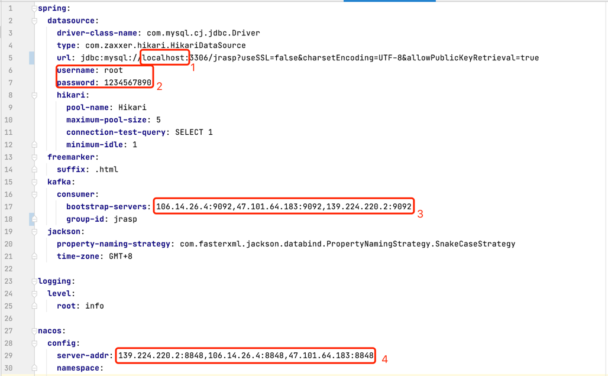

# JRASP后台管理系统

## 系统搭建与工程编译

### 01 数据库初始化

+ 安装mysql数据库(如有，请跳过) 
  
+ 表结构与表数据初始化

工程根目录`sql`下有 `table.sql` 表结构文件和`data.sql`表数据文件，分别在mysql客户端(例如：`MYSQLWorkbench`)中初始化。

初始化之后，默认的登陆用户名称:admin 密码:123456

+ 修改`application-prod.yml`中数据库的ip、用户名和密码(下图中红色数字1和2处)



+ 修改 kafka 集群配置(上图中红色数字3处,单节点也可以)
  
+ 修改 nacos 集群配置(上图中红色数字4处,单节点也可以)

### 02 server 工程修改配置并编译运行
+ 编译环境 jdk8

在工程根目录下执行

```shell
mvn clean package
```
输出jar包在`rasp-admin/target/rasp-admin.jar`

+ 运行

```shell
java -jar rasp-admin.jar
```

可以配置守护进程如使用：`systemctl`或者`supervisor`


### 03 指定额外配置

+ jar包编译好后指定其他配置文件

在运行目录下新建`conf`目录，并创建配置文件 `application.yml`
```java
java -Dspring.config.additional-location=./conf/ -jar rasp-admin.jar
```
`application.yml`文件内容同(`src/main/resources/application-prod.yml`),并修改其中的mysql、kafka、nacos 配置项（上图中红色框中内容）。

### 04 ui工程编译运行

条件：nodejs >= v16.15.1
  
#### 安装编译

进入到ui目录下，执行
```shell
npm install
```
#### 本地启动
```shell
npm start
```

#### 静态文件
```shell
npm run build
```
输出文件在`ui/dist`下